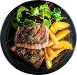
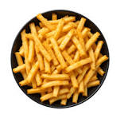
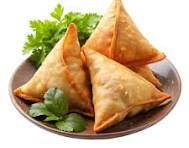

# 🍽️ Restaurant Management Website

**Mapped CO:** CO2

**Objective:** Convert a static HTML website into a visually attractive website using CSS.

---

## Table of Contents

* [Project Overview](#project-overview)
* [Architecture Overview](#architecture-overview)
* [Tech Stack](#tech-stack)
* [Project Structure](#project-structure)
* [Prerequisites](#prerequisites)
* [Quick Start](#quick-start)
* [External CSS](#external-css)
* [Navigation Menu](#navigation-menu)
* [Food Cards](#food-cards)
* [Image Gallery](#image-gallery)
* [Typography](#typography)
* [Colors & Backgrounds](#colors--backgrounds)
* [Spacing](#spacing)
* [Borders & Visual Styling](#borders--visual-styling)
* [CSS Concepts Covered](#css-concepts-covered)
* [Design Overview](#design-overview)
* [Project Workflow](#project-workflow)
* [Key Features](#key-features)
* [Learning Outcomes](#learning-outcomes)
* [Practical Checklist](#practical-checklist)
* [Conclusion](#conclusion)

---

## Project Overview

The **Restaurant Management Website** is a visually attractive static restaurant website developed using **HTML5 and CSS3**.

The project focuses on converting a basic HTML website into a properly styled and visually consistent website using an **external CSS stylesheet**.

The website includes:

* Navigation menu
* Restaurant content
* Food/menu cards
* Image gallery
* About section
* Contact section
* Styled headings and text
* Backgrounds and borders

> The main objective of this practical is to understand how CSS can be used to improve the appearance, layout, spacing, and consistency of a static HTML website.

---

## Architecture Overview

The project follows a simple **HTML + External CSS architecture**.

```text
                 Restaurant Website
                         |
              ┌──────────┴──────────┐
              |                     |
          index.html             style.css
              |                     |
        HTML Structure        CSS Presentation
              |                     |
      ┌───────┼────────┐     ┌──────┼────────┐
      |       |        |     |      |        |
   Header   Menu    Content  Colors Fonts  Spacing
      |       |        |     |      |        |
 Navigation Food     Gallery  Borders Background
            Cards
```

The `index.html` file provides the website structure, while `style.css` controls its visual appearance. The repository also contains an `images` folder for website images.

---

## Tech Stack

| Technology       | Purpose                       |
| ---------------- | ----------------------------- |
| **HTML5**        | Website structure and content |
| **CSS3**         | Styling and visual design     |
| **External CSS** | Centralized website styling   |
| **Images**       | Food and gallery presentation |

The project uses HTML5 for content and CSS3 for visual styling.

---

## Project Structure

```text
Restaurant-Management-Website/
│
├── images/
│   └── Website images
│
├── index.html
├── style.css
└── README.md
```

### File Description

| File / Folder | Description                                           |
| ------------- | ----------------------------------------------------- |
| `index.html`  | Contains the restaurant website structure and content |
| `style.css`   | Contains external CSS styling                         |
| `images/`     | Contains images used by the website                   |
| `README.md`   | Project documentation                                 |

The repository currently contains these main project components.

---

## Prerequisites

No special software or framework is required.

You need:

* A modern web browser
* **VS Code** or another text editor
* Basic knowledge of HTML
* Basic knowledge of CSS

---

## Quick Start

### 1. Clone the Repository

```bash
git clone https://github.com/hareshgavit189/Restaurant-Management-Website.git
```

### 2. Open the Project

```bash
cd Restaurant-Management-Website
```

### 3. Open the Website

Open:

```text
index.html
```

in a web browser.

### 4. Explore the Website

Navigate through the different restaurant sections and view the styled menu, food cards, images, and other content.

> No additional installation or server setup is required because this is a static HTML and CSS project.

---

## External CSS

The project uses an **external CSS stylesheet**:

```html
<link rel="stylesheet" href="style.css">
```

This separates the website's:

```text
Structure → index.html
Presentation → style.css
```

Using an external stylesheet makes it easier to maintain consistent styling throughout the website.

---

## Navigation Menu

The navigation menu provides links to different sections of the restaurant website.

Example:

```html
<nav>
    <a href="#home">Home</a>
    <a href="#menu">Menu</a>
    <a href="#about">About</a>
    <a href="#gallery">Gallery</a>
    <a href="#contact">Contact</a>
</nav>
```

CSS can then be applied to control:

* Navigation layout
* Font size
* Text color
* Background
* Spacing
* Hover appearance
* Borders

---

## Food Cards

Food cards are used to present restaurant menu items in an organized visual format.

A typical card contains:

* Food image
* Food name
* Description
* Price

Example structure:

```html
<div class="food-card">

    

    <h3>Pizza</h3>

    <p>Freshly prepared delicious pizza.</p>

    <p>₹199</p>

</div>
```

CSS can be used to style the card:

```css
.food-card {
    padding: 20px;
    margin: 15px;
    border: 1px solid #ccc;
    background-color: white;
}
```

The repository specifically includes **food cards** as one of the main design features.

---

## Image Gallery

The website contains an image gallery for displaying restaurant and food images.

Example:

```html
<div class="gallery">

    
    
    

</div>
```

CSS can control:

* Image size
* Spacing
* Borders
* Alignment
* Layout
* Visual effects

The project includes an `images` directory and implements image-gallery styling.

---

## Typography

CSS typography is used to improve the readability and visual appearance of the website.

Example:

```css
body {
    font-family: Arial, sans-serif;
}

h1 {
    font-size: 40px;
}

h2 {
    font-size: 30px;
}

p {
    font-size: 16px;
}
```

Important typography properties include:

| Property      | Purpose                 |
| ------------- | ----------------------- |
| `font-family` | Defines the font        |
| `font-size`   | Controls text size      |
| `font-weight` | Controls text thickness |
| `text-align`  | Controls text alignment |
| `line-height` | Controls line spacing   |

---

## Colors & Backgrounds

CSS colors are used to create the visual identity of the restaurant website.

Example:

```css
body {
    background-color: #f5f5f5;
}

header {
    background-color: #222;
}

h1 {
    color: white;
}
```

CSS can apply colors to:

* Text
* Backgrounds
* Navigation
* Cards
* Buttons
* Borders

The project uses custom colors and backgrounds as part of its visual styling.

---

## Spacing

Spacing is important for creating a clean and organized layout.

### Margin

`margin` creates space **outside** an element.

```css
.card {
    margin: 20px;
}
```

### Padding

`padding` creates space **inside** an element.

```css
.card {
    padding: 20px;
}
```

### Difference

```text
        Margin
           ↓
     ┌───────────────┐
     │    Padding    │
     │  ┌─────────┐  │
     │  │ Content │  │
     │  └─────────┘  │
     └───────────────┘
```

Proper margins and padding help maintain consistent spacing throughout the website.

---

## Borders & Visual Styling

Borders can be used to separate and highlight website components.

Example:

```css
.food-card {
    border: 2px solid #ddd;
    border-radius: 10px;
}
```

Important border properties include:

```css
border
border-width
border-style
border-color
border-radius
```

Borders are applied to elements such as:

* Food cards
* Images
* Sections
* Buttons
* Containers

---

## CSS Concepts Covered

| Concept                | Application                    |
| ---------------------- | ------------------------------ |
| **CSS Selectors**      | Select and style HTML elements |
| **Fonts**              | Improve typography             |
| **Colors**             | Style text and backgrounds     |
| **Margin**             | Create external spacing        |
| **Padding**            | Create internal spacing        |
| **Borders**            | Define element boundaries      |
| **Backgrounds**        | Improve visual appearance      |
| **External CSS**       | Separate styling from HTML     |
| **Navigation Styling** | Design navigation menu         |
| **Food Card Styling**  | Design menu items              |
| **Gallery Styling**    | Arrange and style images       |

These concepts correspond to the CSS concepts documented in the repository.

---

## Design Overview

The website uses CSS to improve the visual presentation of the HTML content.

### Navigation

```text
Navigation
├── Layout
├── Colors
├── Typography
└── Spacing
```

### Food Cards

```text
Food Card
├── Image
├── Food Name
├── Description
├── Price
├── Padding
└── Border
```

### Image Gallery

```text
Image Gallery
├── Images
├── Dimensions
├── Spacing
├── Borders
└── Alignment
```

The project applies styling consistently across navigation, food/menu cards, images, headings, backgrounds, borders, and spacing.

---

## Project Workflow

```text
Create Static HTML Website
            |
            v
Create External CSS File
            |
            v
Link style.css to index.html
            |
            v
Style Navigation Menu
            |
            v
Style Food Cards
            |
            v
Apply Fonts & Typography
            |
            v
Apply Colors & Backgrounds
            |
            v
Add Margins & Padding
            |
            v
Add Borders & Visual Effects
            |
            v
Style Image Gallery
            |
            v
Maintain Visual Consistency
            |
            v
Complete Restaurant Website
```

---

## Key Features

* 🎨 **External CSS styling**
* 🧭 **Styled navigation menu**
* 🍔 **Food/menu cards**
* 🖼️ **Image gallery**
* ✍️ **Typography and fonts**
* 🎨 **Custom colors**
* 🌄 **Background styling**
* 📏 **Margins and padding**
* 🔲 **Borders and visual effects**
* 🔄 **Consistent website design**

These are the primary features implemented in the repository.

---

## Learning Outcomes

After completing this practical, the student will be able to:

* [x] Create an external CSS stylesheet.
* [x] Link CSS with an HTML document.
* [x] Use CSS selectors.
* [x] Apply different fonts and typography.
* [x] Apply colors and backgrounds.
* [x] Use margins and padding.
* [x] Apply borders to HTML elements.
* [x] Style navigation menus.
* [x] Design food cards.
* [x] Style image galleries.
* [x] Maintain visual consistency across a website.

---

## Practical Checklist

* [x] Static HTML website created
* [x] External CSS file created
* [x] CSS linked with HTML
* [x] Navigation menu styled
* [x] Food cards designed
* [x] Typography applied
* [x] Colors applied
* [x] Backgrounds applied
* [x] Margins applied
* [x] Padding applied
* [x] Borders applied
* [x] Image gallery styled
* [x] Visual consistency improved

---

## Conclusion

The **Restaurant Management Website** demonstrates how CSS can transform a basic static HTML website into a visually attractive and consistent restaurant interface.

The practical covers important CSS concepts including **selectors, fonts, colors, margins, padding, borders, backgrounds, navigation styling, food card design, and image gallery styling**.

> **Result:** A visually attractive Restaurant Management Website was successfully developed by styling a static HTML website using external CSS.

---

## Author

**Haresh Gavit**

**GitHub Repository:**
[Restaurant Management Website](https://github.com/hareshgavit189/Restaurant-Management-Website)
